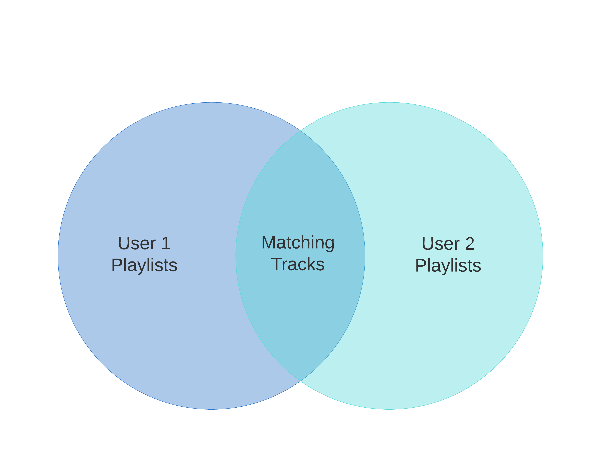

# Bop Match
BopMatch works by scanning through two Spotify users playlists, finding songs that they have in common, and creating a playlist for both to enjoy. Some users may have varying tastes, so  there are three ways to find matching music in order to make the perfect playlist:

# Matching by Track
When matching by track, only songs that appear in both users libraries are added to the match playlist. This produces a playlist with a smaller number of songs with a precise level of matching.

# Matching by Album
When matching by album, any songs that are from the same album as a track in the other user's library are added to the match playlist. This produces a playlist with more songs and moderate match precision.

# Matching by Artist
When matching by album, any songs that are produced by the same artist as a track in the other user's library are added to the match playlist. This produces a large playlists of songs with loose match precision.

# Future Improvements
Bop Match currently exists only in script form, which is not practical or convenient for the average user. In order to make Bop Match more accessible, I am planning on creating a website where users can input their Spotify accounts and match music with friends, artists, or any other Spotify account.
